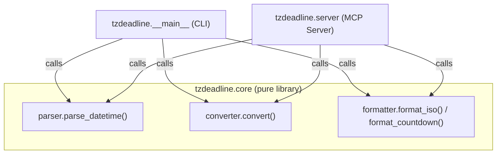

# Design Document: tzdeadline

## Overview

`tzdeadline` is a Python 3.11+ project with two entry points that share a single core conversion
library:

1. **CLI** — a command invoked directly in a terminal that prints a converted datetime and a
   human-readable countdown (or elapsed time) to stdout.
2. **MCP Server** — a lightweight server that exposes the same logic as a single `convert_time`
   MCP tool for use by AI assistants and other MCP-compatible clients.

All timezone arithmetic is performed offline using only the Python standard-library `zoneinfo`
module. No third-party timezone library (e.g., `pytz`, `dateutil`) and no network I/O is required
at runtime.

---

## Architecture



The three layers are deliberately independent:

| Layer | Responsibility | May raise |
|-------|---------------|-----------|
| `tzdeadline.core.parser` | Parse a raw string into a naive `datetime` | `ParseError` |
| `tzdeadline.core.converter` | Attach source tzinfo, convert to target tzinfo | `ConversionError` |
| `tzdeadline.core.formatter` | Render a `ConversionResult` as ISO 8601 + countdown | — |
| `tzdeadline.__main__` | Parse CLI args, call core, print to stdout/stderr, sys.exit | — |
| `tzdeadline.server` | Register and serve the `convert_time` MCP tool | — |

---

## Components and Interfaces

### `tzdeadline.core.parser`

```python
class ParseError(ValueError):
    """Raised when a datetime string cannot be parsed."""

def parse_datetime(dt_string: str) -> datetime:
    """
    Parse dt_string into a naive datetime object.

    Accepted formats:
      - "YYYY-MM-DDTHH:MM:SS"         (ISO 8601 T-separator)
      - "YYYY-MM-DD HH:MM:SS"         (space separator)
      - "YYYY-MM-DDTHH:MM:SS+HH:MM"   (with UTC offset)
      - "YYYY-MM-DD HH:MM:SS+HH:MM"   (with UTC offset)

    Raises:
        ParseError: if the string does not match any accepted format.
    """
```

Parsing strategy: try `datetime.fromisoformat()` first (handles all four formats in Python 3.11+).
If that raises `ValueError`, raise `ParseError` with a descriptive message.

The returned `datetime` is **naive** (no `tzinfo`) when no offset is present, or carries the
literal offset as a fixed `timezone` object when an offset is present. The `converter` layer is
responsible for attaching the IANA `ZoneInfo` object.

---

### `tzdeadline.core.converter`

```python
from zoneinfo import ZoneInfo, ZoneInfoNotFoundError
from dataclasses import dataclass

class ConversionError(ValueError):
    """Raised when a timezone identifier is not recognised by zoneinfo."""

@dataclass(frozen=True)
class ConversionResult:
    converted_dt: datetime   # timezone-aware, expressed in target zone
    source_tz: str           # original IANA identifier
    target_tz: str           # target IANA identifier

def convert(
    dt: datetime,
    source_tz: str,
    target_tz: str,
) -> ConversionResult:
    """
    Attach source_tz to dt, then convert to target_tz.

    Raises:
        ConversionError: if source_tz or target_tz is not recognised by zoneinfo.
    """
```

Implementation notes:
- Load both `ZoneInfo` objects first; re-raise `ZoneInfoNotFoundError` as `ConversionError`.
- If `dt` is already timezone-aware (carries an offset from parsing), call `dt.replace(tzinfo=None)`
  to strip the offset before attaching the IANA source zone, preserving wall-clock time semantics.
- Use `dt.replace(tzinfo=source_zone).astimezone(target_zone)` for the conversion.

---

### `tzdeadline.core.formatter`

```python
def format_iso(dt: datetime) -> str:
    """Return dt as an ISO 8601 string with UTC offset, e.g. '2025-12-31T23:59:00+01:00'."""

def format_countdown(dt: datetime, now: datetime | None = None) -> str:
    """
    Return a human-readable countdown string.

    If now is None, defaults to datetime.now(tz=timezone.utc).
    Positive delta  →  "in X days, Y hours, Z minutes"
    Negative delta  →  "X days, Y hours, Z minutes ago"
    """
```

`now` is injectable for deterministic testing.

---

### `tzdeadline.__main__` (CLI)

Argument parsing via `argparse`:

```
tzdeadline <datetime> <source_tz> <target_tz>
```

Data flow:
1. `parse_datetime(args.datetime)` → naive `datetime` or `ParseError`
2. `convert(dt, args.source_tz, args.target_tz)` → `ConversionResult` or `ConversionError`
3. Print `format_iso(result.converted_dt)` to stdout
4. Print `format_countdown(result.converted_dt)` to stdout

On `ParseError` or `ConversionError`: print the exception message to **stderr** and call
`sys.exit(1)`.

---

### `tzdeadline.server` (MCP Server)

Uses the [MCP Python SDK](https://github.com/modelcontextprotocol/python-sdk) (`mcp` package).

```python
@mcp.tool()
def convert_time(
    datetime_str: str,
    source_tz: str,
    target_tz: str,
) -> dict:
    """
    Convert datetime_str from source_tz to target_tz.

    Returns:
        {"converted_datetime": str, "countdown": str}   on success
        {"error": str}                                   on ParseError / ConversionError
    """
```

The handler catches `ParseError` and `ConversionError` explicitly and returns a structured error
dict rather than letting exceptions propagate.

---

## Data Models

### `ConversionResult`

| Field | Type | Description |
|-------|------|-------------|
| `converted_dt` | `datetime` | Timezone-aware datetime in the target zone |
| `source_tz` | `str` | IANA identifier of the source timezone |
| `target_tz` | `str` | IANA identifier of the target timezone |

### CLI Output Format

```
2025-12-31T23:59:00+01:00
in 3 days, 4 hours, 12 minutes
```

Or for a past deadline:

```
2025-01-01T09:00:00+00:00
2 hours, 30 minutes ago
```

### MCP Tool Response Schema

Success:
```json
{
  "converted_datetime": "2025-12-31T23:59:00+01:00",
  "countdown": "in 3 days, 4 hours, 12 minutes"
}
```

Error:
```json
{
  "error": "Unknown timezone: 'Mars/Olympus_Mons'"
}
```

---

## Correctness Properties

*A property is a characteristic or behavior that should hold true across all valid executions of a
system — essentially, a formal statement about what the system should do. Properties serve as the
bridge between human-readable specifications and machine-verifiable correctness guarantees.*

### Property 1: Round-trip timezone conversion

*For any* valid naive datetime string and any pair of valid IANA timezone identifiers (A, B),
converting from A → B and then from B → A SHALL produce a datetime whose UTC representation is
equivalent to the UTC representation of the original datetime converted from A.

**Validates: Requirements 5.1**

---

### Property 2: Parser round-trip

*For any* valid naive datetime object, formatting it as both accepted ISO 8601 variants
(`YYYY-MM-DDTHH:MM:SS` and `YYYY-MM-DD HH:MM:SS`) and then parsing each result SHALL produce a
datetime equivalent to the original (ignoring microseconds, which are not part of the accepted
format).

**Validates: Requirements 3.1**

---

### Property 3: Invalid timezone identifiers always produce errors

*For any* string that is not a valid IANA timezone identifier (i.e., not present in
`zoneinfo.available_timezones()`), passing it as either the source or target timezone to
`convert()` SHALL raise `ConversionError`.

**Validates: Requirements 1.3**

---

### Property 4: Invalid datetime strings always produce errors

*For any* string that does not conform to any of the accepted datetime formats, calling
`parse_datetime()` SHALL raise `ParseError`.

**Validates: Requirements 3.2**

---

### Property 5: Countdown direction reflects past vs. future

*For any* datetime `dt` and any fixed reference `now`, `format_countdown(dt, now)` SHALL contain
"ago" if and only if `dt < now` (comparing both as UTC-normalised datetimes).

**Validates: Requirements 2.2, 2.3**

---

### Property 6: Converted datetime is timezone-aware in the target zone

*For any* valid input (datetime string, source zone, target zone), the `converted_dt` field of the
returned `ConversionResult` SHALL be timezone-aware and its `tzinfo` SHALL correspond to the
requested target IANA timezone.

**Validates: Requirements 1.1**

---

### Property 7: MCP handler returns structured error for invalid inputs

*For any* invalid combination of datetime string and/or timezone identifiers, calling the
`convert_time` handler SHALL return a dict containing an `"error"` key rather than raising an
unhandled exception.

**Validates: Requirements 4.3**

---

## Error Handling

| Error type | Trigger | CLI behaviour | MCP behaviour |
|------------|---------|---------------|---------------|
| `ParseError` | Unrecognised datetime string | Print to stderr, exit 1 | Return `{"error": message}` |
| `ConversionError` | Unrecognised IANA timezone | Print to stderr, exit 1 | Return `{"error": message}` |
| Unexpected exception | Any other runtime failure | Print generic message to stderr, exit 1 | Re-raise (let MCP SDK handle) |

Both custom exception classes inherit from `ValueError`, giving callers a common base to catch when
they want to handle all user-input errors uniformly.

---

## Testing Strategy

### Dual approach

- **Unit / example tests** — cover specific inputs, boundary conditions, and error paths.
- **Property-based tests** — validate universal properties across a large random input space.

Both suites are complementary: example tests pin known-good behaviour; property tests explore the
input space that examples miss (DST transitions, sub-hour UTC offsets such as `Asia/Kolkata
+05:30`, leap seconds adjacent datetimes, etc.).

### Property-based testing library

[Hypothesis](https://hypothesis.readthedocs.io/) is the standard property-based testing library
for Python and will be used for all property tests. Each property test is configured to run a
minimum of **100 iterations** via `@settings(max_examples=100)`.

Each property test is annotated with a comment of the form:

```
# Feature: tzdeadline, Property N: <property title>
```

### Property test coverage

| Design Property | Test description | Hypothesis strategy |
|-----------------|-----------------|---------------------|
| Property 1 | Round-trip A→B→A | `st.datetimes(timezones=st.none())` × `st.sampled_from(available_timezones)` × same |
| Property 2 | Parser round-trip | `st.datetimes(min_value=..., max_value=...)` formatted as both string variants |
| Property 3 | Invalid timezone → error | `st.text()` filtered to exclude `available_timezones()` |
| Property 4 | Invalid datetime string → error | `st.text()` filtered to exclude valid format patterns |
| Property 5 | Countdown direction | `st.datetimes(timezones=st.just(utc))` pairs |
| Property 6 | Result is aware in target zone | Same strategy as Property 1 |
| Property 7 | MCP handler structured error | Combined invalid-input strategies from Props 3 & 4 |

### Unit test coverage (example-based)

- Parse each accepted format variant with a concrete datetime string.
- Verify ISO 8601 output format with UTC offset via regex.
- Verify past-deadline label ("ago") and future-deadline label ("in …") with fixed `now`.
- Verify `convert_time` MCP handler returns expected keys on valid input.
- Verify `convert_time` MCP handler returns `{"error": ...}` on invalid timezone and on
  unparseable datetime string.
- Verify CLI exits 0 on valid input and exits 1 on each error class.

### Test layout

```
tests/
  unit/
    test_parser.py
    test_converter.py
    test_formatter.py
    test_mcp_handler.py
    test_cli.py
  property/
    test_round_trip.py        # Properties 1, 2, 6
    test_error_conditions.py  # Properties 3, 4, 7
    test_countdown.py         # Property 5
```
